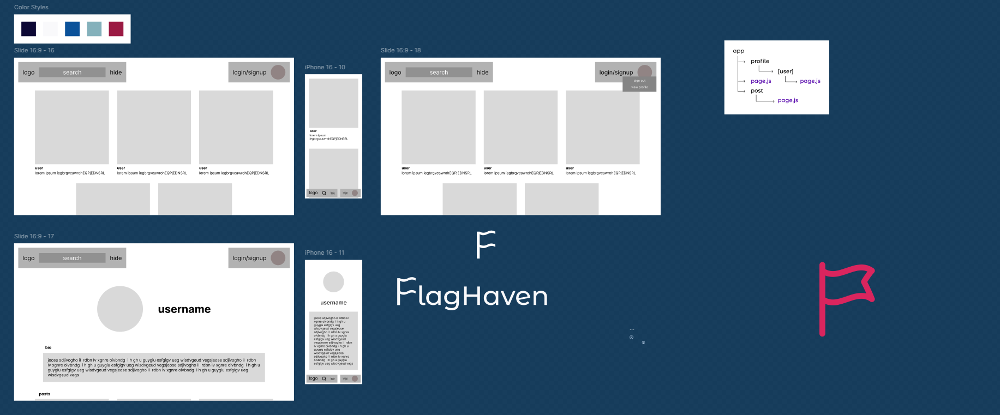
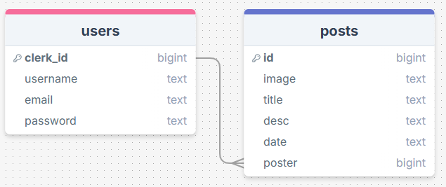

# Pre-Development




```sql
CREATE TABLE IF NOT EXISTS fh_users (
  clerk_id TEXT PRIMARY KEY,
  username TEXT UNIQUE NOT NULL,
  email    TEXT NOT NULL,
  bio      TEXT
);

CREATE TABLE IF NOT EXISTS fh_posts (
  id      BIGINT PRIMARY KEY GENERATED ALWAYS AS IDENTITY,
  image   TEXT NOT NULL,
  poster  TEXT NOT NULL REFERENCES fh_users(clerk_id),
  title   TEXT,
  caption TEXT NOT NULL,
  date    DATE NOT NULL
);
```

# Reflection

## What Went Well

- i completed all but the final requirement to a decent stadard
- i got to understand how shdcn works and felt how simple its integration is
- i expanded my knowledge of clerk by delving into the docs to find the tools i wanted such as `useUser()` and `<UserProfile.MenuItems>`
- i linked a client form to a server action, something i&apos;ve never done before
- this site has some of my favourite styling i have done on the course, and likely of all time — mainly `global-error.js`
- i leanrt more about both global handling files for not found and other errors, which allowed me to use them more effectively

## What Went Worse

- i went over teh deadline again — I need to focus more and not push things back in the future
- i failed to make a route to creat posts, and rushed the `Post.jsx` component at the end.
  - this, of course, means i also didn&apos;t achieve any strtch goals either
- i hade several problematic errors due to small syntactical and logical mistakes that led me to get slightly tilted near the end of the project
  - Next&apos;s `Image` component doesn't seem to be very compatible with clerk&apos;s `user.imageurl` property, causing me to have to use a regular `` tag in `ProfilePic.jsx`

## Overall

I think my skills are good enough to handle what we are doing, however, I struggle to work for remotley long periods of time which causes me to lose a lot of time. To combat this, I think I jsut have to push through when I feel like slowing down so that i&apos;m still producitve over the course of the project.
